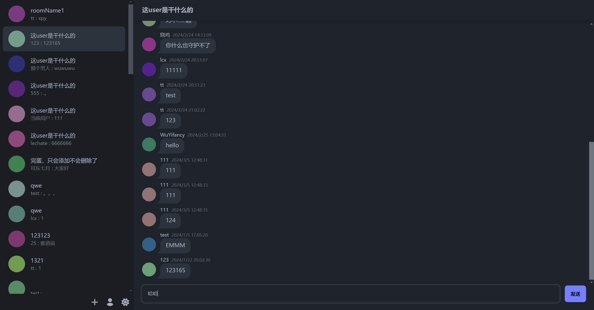
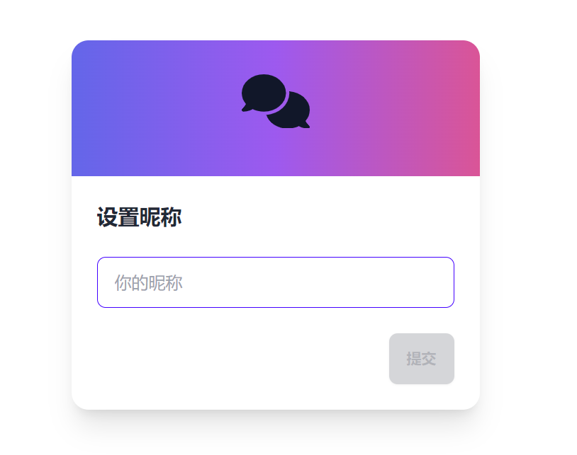
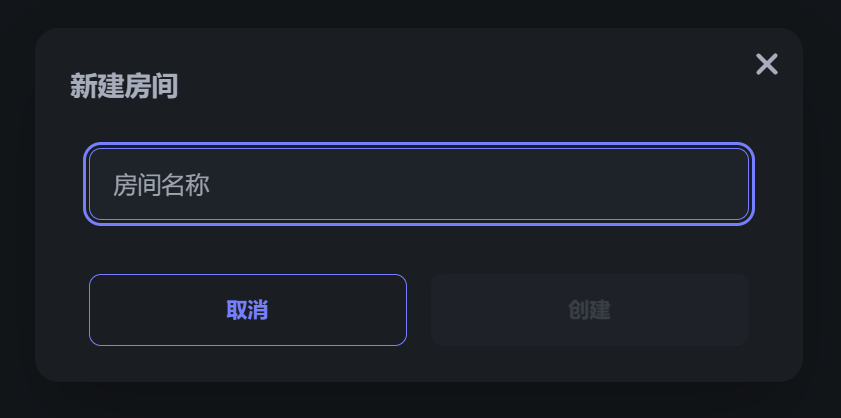

# 聊天室

XLab 前端进阶项目，在线预览地址[https://cyrus28214.top/chat-room/](https://cyrus28214.top/chat-room/)

## 技术栈

- 基于 React + TypeScript + Vite 搭建
- 使用 Tailwindcss + DaisyUI 进行样式设计
- 使用 Axios + SWR 实现数据请求和缓存

## 项目特点

- 支持白天和黑夜模式切换
- 点击按钮后有友好的模态框提示信息
- 为图标按钮添加了Tooltip提示信息
- 使用 `localStorage` 缓存了用户信息，刷新页面后依然可以保持状态
- 完善的类型标注，充分利用了 TypeScript 的强大功能，几乎没有`any`。

## 效果展示

